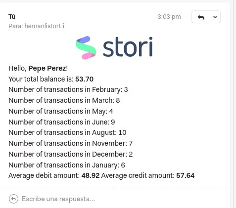

# stori-service

Stori project with docker, postgres, migrations and ping endpoint

## Development containers

In the project there is a docker-compose file used to lift the entire work environment without installing frames or tools used by the project

-   Install Docker `sudo apt-get install docker-compose`

-   Create the `.env` file based on `.env.example`.

-   Create a global bridge network

```
docker network create herno-net
```

-   Build docker orchestra

```bash
$ docker-compose build
```

-   Run docker orchestra

```bash
$ docker-compose up -d
```

-   Check service up

```bash
$ curl http://localhost:9009/ping
```

## Migrations

-   Run all internal migrations

Development

```bash
$ docker-compose exec app go run migrations/internal/*.go migrate
```

-   Run all external migrations

```bash
$ docker-compose exec app go run migrations/external/*.go migrate
```

Tests

```bash
$ docker-compose exec -e APP_ENV=testing app go run migrations/internal/*.go migrate
```

If you need to rollback, just change the final word `migrate` for `rollback` (roll back the previous run batch of migrations)

-   Create internal migrations

```bash
$ go run migrations/internal/*.go create <migration_name>
```

-   Create external migrations

```bash
$ go run migrations/external/*.go create <migration_name>
```

## Unit tests

-   Run all test

```bash
$ docker-compose exec -e APP_ENV=testing app go test -cover -p 1 ./...
```

With better format:

```bash
$ docker-compose exec -e APP_ENV=testing app gotestsum --format testname -- ./... -p 1 -count 1 -cover -coverprofile cover.out
```

Clean cache (Useful for forcing tests to run again)

```bash
$ docker-compose exec app go clean -testcache
```

## How it works?
It processes the files from ./files/ directory with the given ID when a request is made to
localhost:9009/v1/client/client-movements/:id
Currently only works with id=1 and id=2 because there's no logic for creating new users and there are only these two.

Image of the email received by the user:
